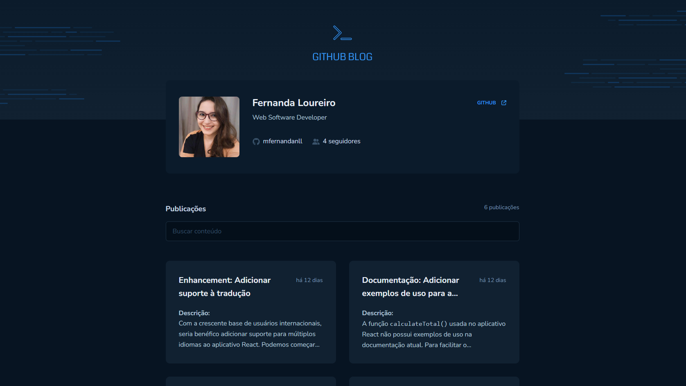
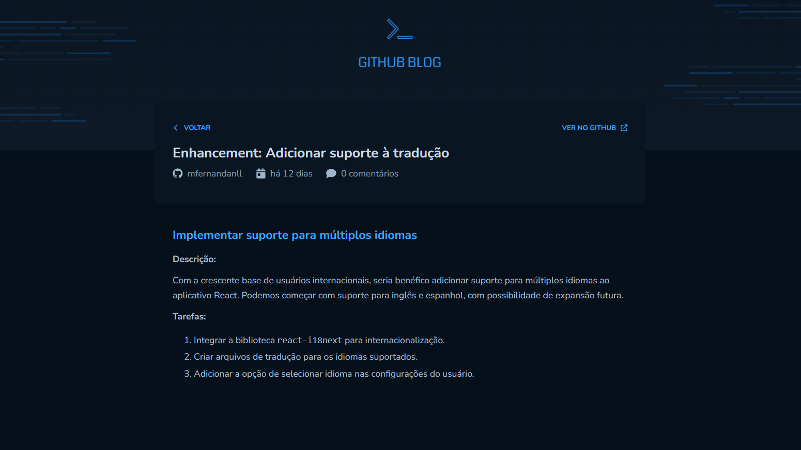

<h1 align="center" style="text-align: center;">
  Github Blog :computer:
</h1>

> Blog pessoal de issues do github

<p align="center">
  <a href="#project">Projeto</a>&nbsp;&nbsp;&nbsp;|&nbsp;&nbsp;&nbsp;
  <a href="#layout">Layout</a>&nbsp;&nbsp;&nbsp;|&nbsp;&nbsp;&nbsp;
  <a href="#technologies">Tecnologias</a>&nbsp;&nbsp;&nbsp;|&nbsp;&nbsp;&nbsp;
  <a href="#usage">Utilização</a>&nbsp;&nbsp;&nbsp;|&nbsp;&nbsp;&nbsp;
  <a href="#license">Licença</a>
</p>

<p align="center">
  
</p>

<h2 id="project">📁 Projeto</h2>

Este projeto consiste em um blog pessoal que se conecta à API do GitHub para exibir postagens, que são carregadas diretamente das issues de um repositório. Sempre que uma nova issue é criada, ela aparece no blog junto com as outras postagens.

Além disso, o blog exibe o perfil do usuário do GitHub, mostrando a foto, o número de seguidores, o nome e outras informações disponíveis na API. Também há uma funcionalidade de busca para localizar postagens específicas. Na página inicial, os posts são resumidos, e ao clicar em um deles, o usuário é levado a uma página dedicada onde pode ler o conteúdo do post completo.

O projeto apresenta várias funcionalidades, como a navegação entre páginas usando React Router DOM, requisições feitas com Axios, a exibição de posts formatados com ReactMarkdown, entre outras.


<h2 id="layout">🎨 Layout</h2>

A aplicação conta com as seguintes páginas:

- Home

- Detalhes do post



<h2 id="technologies">💻 Tecnologias</h2>

Este projeto foi desenvolvido com as seguintes tecnologias:

- Typescript
- ReactJS
- ViteJS
- Context API
- React Router DOM
- Styled Components
- Axios
- React Markdown
- Context Selector

<h2 id="usage">💡 Utilização</h2>

A aplicação Github Blog está disponível para uso [aqui](https://github-issues-blog.netlify.app/).

Você também pode executá-la em sua máquina localmente. Certifique-se de ter o ``Node.js`` e o ``npm`` instalados antes de prosseguir com as etapas abaixo:

1. Clone o projeto:

```
$ git clone https://github.com/mfernandanll/github-blog
```

2. Acesse a pasta do projeto:

```
$ cd github-blog
```

3. Instale as dependências:

```
$ npm install
```

4. Inicie o servidor do frontend:

```
$ npm run dev
```

5. O terminal irá exibir o endereço local onde a aplicação está sendo executada. Basta digitar o mesmo endereço em seu navegador preferido. O endereço usado na criação do projeto foi este:
 
```
  http://localhost:5173/
```


<h2 id="license">📝 Licença</h2>

Este projeto está sob a licença MIT.

---

Made with ❤ by Fernanda Loureiro 👋 [Get in Touch!](https://www.linkedin.com/in/maria-fernanda-loureiro/)
